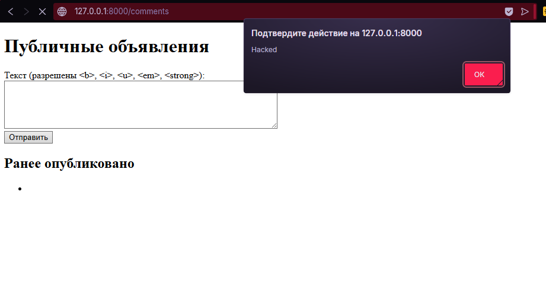
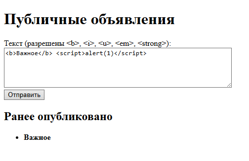
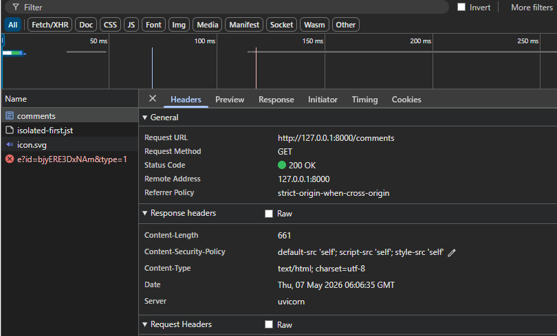
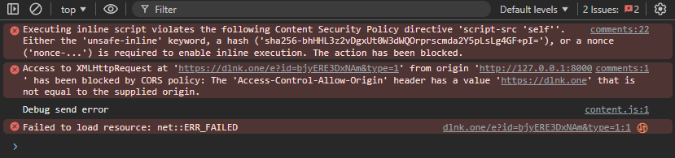

# Домашнее задание №6

### До защиты: демонстрация XSS-атаки `alert(1)`:

### После защиты: санитизация через Bleach:

### Заголовок CSP в ответе (Network):

### Блокировка атаки политикой CSP (Console):

