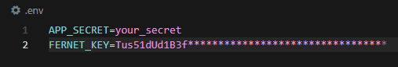
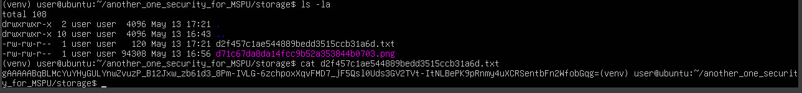
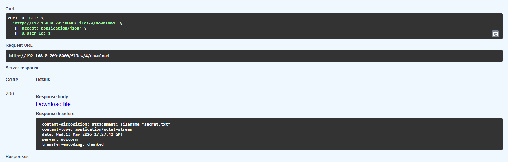
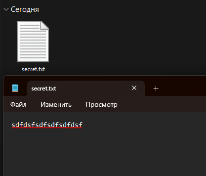

# Домашнее задание №10

### Скриншот локального файла `.env` (звёздочками замазана часть ключа):

### Скриншот терминала сервера с зашифрованным текстом:

### Скриншоты: браузера, где я могу скачать текстовый файл; с текстовым файлом, показывающий читаемый текст, что был написан до шифрования. 

